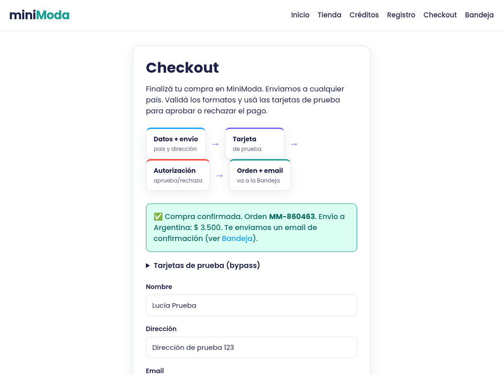

# BUG-001 · El checkout confirma la compra con el carrito vacío

| | |
|---|---|
| **Severidad** | Alta · se generan órdenes sin productos que cobran el envío; no bloquea comprar, por eso no es crítica |
| **Entorno** | https://minimoda-navy.vercel.app · Chromium · Linux · 2026-10-07 |
| **Frecuencia** | Siempre: 3 de 3 intentos manuales |
| **Riesgo relacionado** | R-01 |
| **Caso relacionado** | CP-016 |

## Pasos para reproducir
1. Abrir una ventana nueva (carrito vacío) e ir directo a https://minimoda-navy.vercel.app/checkout.
2. Completar: Nombre `Lucía Prueba` · Dirección `Dirección de prueba 123` · Email `lucia.qa@example.com` · País `Argentina`.
3. Tarjeta `4111111111111111` · Vencimiento `12/30` · CVV `123`.
4. Tocar **Confirmar compra**.

**Datos:** solo ficticios. La tarjeta es de prueba (la publica la tienda).

## Resultado esperado
La compra se bloquea con un aviso del tipo "Tu carrito está vacío" y un link a la tienda. No se genera orden ni email.

## Resultado obtenido
Aparece "✅ Compra confirmada. Orden MM-860463. Envío a Argentina: $ 3.500. Te enviamos un email de confirmación (ver Bandeja)." Se genera una orden sin productos que solo cobra el envío. (El número de orden cambia en cada intento.)

## Evidencia

## Notas
- En DevTools, Network: "Confirmar compra" no hace ningún request al servidor; la orden se arma en el navegador. Hace falta validar el carrito antes de confirmar (idealmente en el servidor).
