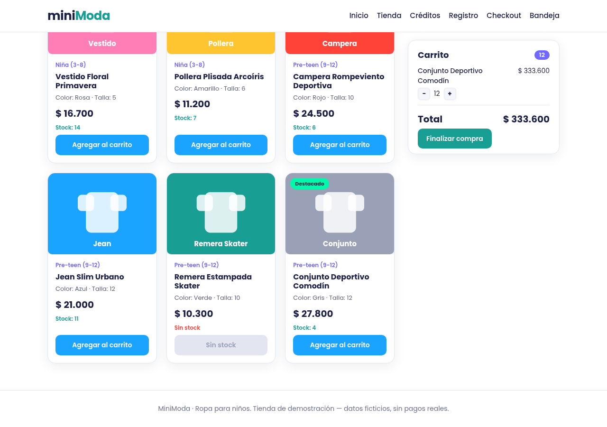

# BUG-002 · El carrito acepta más unidades que el stock disponible

| | |
|---|---|
| **Severidad** | Alta · permite vender lo que no hay: órdenes que no se pueden entregar, devoluciones y reclamos |
| **Entorno** | https://minimoda-navy.vercel.app/tienda · Chromium · Linux · 2026-10-07 |
| **Frecuencia** | Siempre |
| **Riesgo relacionado** | R-02 |
| **Caso relacionado** | CP-011 (falla) · CP-010 (pasa: hasta 4 unidades) · consulta 6 de [validaciones-stock.sql](../sql/validaciones-stock.sql) |

## Pasos para reproducir
1. Abrir https://minimoda-navy.vercel.app/tienda con el carrito vacío.
2. Buscar **Conjunto Deportivo Comodín** (Pre-teen 9-12, $ 27.800). La tarjeta dice **Stock: 4**.
3. Tocar **Agregar al carrito** 5 veces.
4. En el carrito, tocar **+** hasta llegar a 12.

## Resultado esperado
Al llegar a 4 unidades, el botón "Agregar al carrito" y el "+" del carrito se deshabilitan (o muestran "No hay más stock") y la cantidad no pasa de 4.

## Resultado obtenido
La 5.ª unidad se agrega sin aviso y se puede llegar a 12 unidades: el carrito muestra 12 y total **$ 333.600**. Con "Finalizar compra" se llega al checkout sin ningún control de stock.

## Evidencia

## Notas
- Con los productos sin stock (stock 0) el botón sí se deshabilita (CP-006 pasa): el control existe, pero no compara la cantidad del carrito con el stock.
